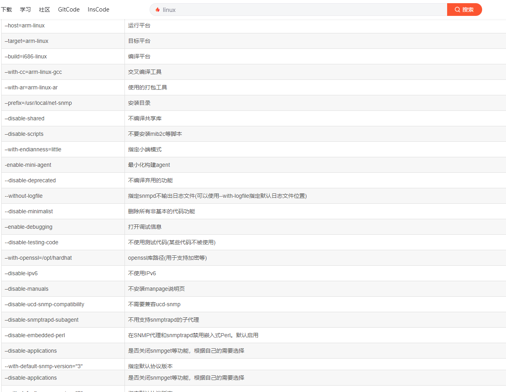

# SNMP

## 移植和mib2c的使用

1. 下载源码http://www.net-snmp.org/download.html，下面使用net-snmp-5.7.3版本介绍

2. tar -zxvf net-snmp-5.7.3.tar.gz

3. 进入net-snmp-5.7.3目录

4. 配置`.configure`

    ```ASN.1
    sudo ./configure  --prefix=/usr/local/snmp --with-default-snmp-version="2" --with-sys-contact="contact@contact" --with-sys-location="location" --with-logfile="/var/log/snmpd.log" --with-persistent-directory="/var/net-snmp"     --在虚拟机中使用，先不添加mib库
    
    sudo ./configure --host=arm-linux --target=arm --with-cc=arm-linux-gnueabihf-gcc --with-ar=arm-linux-ar --with-endianness=little --enable-mini-agent --prefix=/usr/local/snmp --with-default-snmp-version="2" --with-sys-contact="contact@contact" --with-sys-location="location" --with-logfile="/var/log/snmpd.log" --with-persistent-directory="/var/net-snmp"     --在开发板上使用，先不添加mib库
    ```
    
4. 

5. 先执行`make clean`,然后在执行`make`

6. 执行`sudo make install`，进行安装

7. **报错处理**

    1. snmpd: error while loading shared libraries: libnetsnmpagent.so.25: cannot open shared object file: No such file or directory
        **解决方法：export LD_LIBRARY_PATH=/usr/local/snmp/lib 或vi /etc/profile 在最后一行加入：export LD_LIBRARY_PATH=/usr/local/snmp/lib**

    2. 没有perl库问题：/usr/bin/ld: cannot find -lperl
        解决方法：**sudo apt-get install libperl-dev 或者 执行./configure配置时跟上–disable-embedded-perl参数，不安装此库，mib2c工具不能使用**
        也许还会碰到缺少 libtool,openssl,zlib库的情况，请直接安装。
        一般遇到这种缺少了什么库的问题，都是通过安装libXXX-dev或者安装XXX-dev来解决。但也不绝对，有的时候是因为相关的库不是安装在系统的默认路径，也没用加入到环境变量中

8. 

    ```
    文件夹说明：
    		bin: snmp自带工具，主要是mib2c自动生成文件工具
    		etc: 配置文件夹
    		include: snmp头文件
    		lib: snmp依赖文件
    		sbin: snmpd代理
    		share: 重点是mibs库
    ```

    

9. 使用`ls`命令查看/usr/local/snmp目录下是否存在etc目录，如果不存在使用’mkdir etc’在该目录下新建文件夹etc，将snmp源码目录下的EXAMPLE.conf文件拷贝到/usr/local/snmp/etc文件夹下"cp EXAMPLE.conf /usr/local/snmp/etc/snmpd.conf"

10. 修改snmp.conf文件

    ```c
    1）agentAddress udp:127.0.0.1:161修改为agentAddress udp:161
    2) 将trapsink localhost public行注释
    3) 将trap2sink localhost public行取消注释
    4) 将rocommunity public default -V systemmonly修改为rwcommunity public default
    ```

11. 运行snmpd代理

     ```
     执行命令：   /usr/local/snmp/sbin/snmpd -c /usr/local/snmp/etc/snmpd.conf    --运行snmpd代理程序，-c用于链接配置文件
     ```

12. 配置snmp工具的使用路径，这样子系统才能找到mib2c工具

     ```
     export LD_LIBRARY_PATH=/usr/local/snmp/lib    或    vi /etc/profile 在最后一行加入：export LD_LIBRARY_PATH=/usr/local/snmp/lib
     ```

13. 测试一下系统是否已经可以找到snmp的工具链

14. 将写好的mib库（可以自己写，也可以使用MIB builder软件生成）移动到`/usr/local/snmp/share/snmp/mibs`目录下，后缀可以是 XXX.txt或者XXX.mib

     ```ASN.1
     --
     -- OTS3000-C2-OPMV2.my
     -- MIB generated by MG-SOFT Visual MIB Builder Version 6.0  Build 88
     -- Monday, June 13, 2016 at 13:41:13
     --
     
     --  OTS3000-C2-OPMV2.my
     -- MIB generated by MG-SOFT Visual MIB Builder Version 6.0  Build 88
     -- Monday, June 13, 2016 at 11:48:18
     -- 
     --  MG-SOFT Corporation root SMI
     -- 
     -- Copyright (C) 1995, 1998 by MG-SOFT Corporation.
     -- All rights reserved.
     -- 
     -- Comments to: <info@mg-soft.si>
     -- Web URL: http://www.mg-soft.si/
     -- 
     
     	TEST-MIB DEFINITIONS ::= BEGIN
      
     		IMPORTS
     			enterprises, Integer32, OBJECT-TYPE, MODULE-IDENTITY			
     				FROM SNMPv2-SMI			
     			TEXTUAL-CONVENTION			
     				FROM SNMPv2-TC;
     	
     	
     --  1.3.6.1.4.1.40989
     -- November 24, 1998 at 01:00 GMT
     -- May 08, 2015 at 17:01 GMT
     		-- 1.3.6.1.4.1.40989
     		glsun MODULE-IDENTITY 
     			LAST-UPDATED "199811240100Z"		-- November 24, 1998 at 01:00 GMT
     			ORGANIZATION 
     				"MG-SOFT Corporation"
     			CONTACT-INFO 
     				"MG-SOFT Corporation
     				Strossmayerjeva 32A
     				2000 Maribor
     				Slovenia
     				
     				Phone:  +386 62 2295050
     				Fax:    +386 62 2295051
     				Web:    http://www.mg-soft.si/
     				E-Mail: info@mg-soft.si"
     			DESCRIPTION 
     				"MG-SOFT Corporation root MIB module."
     			REVISION "201505081701Z"		-- May 08, 2015 at 17:01 GMT
     			DESCRIPTION 
     				"OAP MIB FILE"
     			::= { enterprises 40989 }
     
     		
     	
     --
     -- Textual conventions
     --
     	
     		OpticalPower ::= TEXTUAL-CONVENTION
     			STATUS current
     			DESCRIPTION 
     				"Description."
     			SYNTAX Integer32
     
     	
     --
     -- Node definitions
     --
     	
     --  Node definitions
     -- 
     		-- 1.3.6.1.4.1.40989.10
     		device OBJECT IDENTIFIER ::= { glsun 10 }
     
     		
     		-- 1.3.6.1.4.1.40989.10.16
     		ost3000 OBJECT IDENTIFIER ::= { device 16 }
     
     		
     		-- 1.3.6.1.4.1.40989.10.16.2
     		card2 OBJECT IDENTIFIER ::= { ost3000 2 }
     
     		
     		-- 1.3.6.1.4.1.40989.10.16.2.13
     		opdv2 OBJECT IDENTIFIER ::= { card2 13 }
     
     		
     		-- 1.3.6.1.4.1.40989.10.16.2.13.1
     		State OBJECT-TYPE
     			SYNTAX INTEGER
     				{
     				off(0),
     				on(1)
     				}
     			MAX-ACCESS read-only
     			STATUS current
     			DESCRIPTION
     				"Description."
     			::= { opdv2 1 }
     
     		-- 1.3.6.1.4.1.40989.10.16.2.13.24
     		c2CH1Wave OBJECT-TYPE
     			SYNTAX INTEGER
     				{
     				1310nm(0),
     				1550nm(1)
     				}
     			MAX-ACCESS read-write
     			STATUS current
     			DESCRIPTION
     				"Description."
     			::= { opdv2 2 }
     
     
     		-- 1.3.6.1.4.1.40989.10.16.2.13.72
     		AlarmStatus OBJECT-TYPE
     			SYNTAX INTEGER
     				{
     				alarm(0),
     				normal(1)
     				}
     			MAX-ACCESS read-only
     			STATUS current
     			DESCRIPTION
     				"Description."
     			::= { opdv2 3 }
     	END
     
     --
     -- OTS3000-C2-OPMV2.my
     --
     ```

     

15. 使用命令：`export MIBS=ALL `将导出全部的mibs中的库

16. 使用命令：` /usr/local/snmp/bin/snmptranslate -Tp -IR XXX-MIB::节点`,检测我们写的mib库格式是否正确(文件格式一定要是文本)

     

17. 使用工具mib2c生成代码：`env MIBS="+/usr/local/snmp/share/snmp/mibs/XXX-MIB.txt" /usr/local/snmp/bin/mib2c 节点`（说明：mib2c工具支持的格式：XX.txt、XXX.mib、XXX.my）

18. 生成的代码

     ```c
     /*
      * Note: this file originally auto-generated by mib2c using
      *        $
      */
     
     #include <net-snmp/net-snmp-config.h>
     #include <net-snmp/net-snmp-includes.h>
     #include <net-snmp/agent/net-snmp-agent-includes.h>
     #include "device.h"
     
     /** Initializes the device module */
     void
     init_device(void)
     {
         //工具mib库创建节点
         const oid State_oid[] = { 1,3,6,1,4,1,40989,10,16,2,13,1 };
         const oid c2CH1Wave_oid[] = { 1,3,6,1,4,1,40989,10,16,2,13,2 };
         const oid AlarmStatus_oid[] = { 1,3,6,1,4,1,40989,10,16,2,13,3 };
     
       DEBUGMSGTL(("device", "Initializing\n"));
     
         //节点处理回调函数
         netsnmp_register_scalar(
             netsnmp_create_handler_registration("State", handle_State,
                                    State_oid, OID_LENGTH(State_oid),
                                    HANDLER_CAN_RONLY
             ));
         netsnmp_register_scalar(
             netsnmp_create_handler_registration("c2CH1Wave", handle_c2CH1Wave,
                                    c2CH1Wave_oid, OID_LENGTH(c2CH1Wave_oid),
                                    HANDLER_CAN_RWRITE
             ));
         netsnmp_register_scalar(
             netsnmp_create_handler_registration("AlarmStatus", handle_AlarmStatus,
                                    AlarmStatus_oid, OID_LENGTH(AlarmStatus_oid),
                                    HANDLER_CAN_RONLY
             ));
     }
     
     int
     handle_State(netsnmp_mib_handler *handler,
                               netsnmp_handler_registration *reginfo,
                               netsnmp_agent_request_info   *reqinfo,
                               netsnmp_request_info         *requests)
     {
         /* We are never called for a GETNEXT if it's registered as a
            "instance", as it's "magically" handled for us.  */
     
         /* a instance handler also only hands us one request at a time, so
            we don't need to loop over a list of requests; we'll only get one. */
         int value
         switch(reqinfo->mode) {
         //获取节点数据
             case MODE_GET:
                 snmp_set_var_typed_value(requests->requestvb, ASN_INTEGER,
                                         &value /* XXX: a pointer to the scalar's data */,
                                       sizeof(value)/* XXX: the length of the data in bytes */);
                 break;
     
             default:
                 /* we should never get here, so this is a really bad error */
                 snmp_log(LOG_ERR, "unknown mode (%d) in handle_State\n", reqinfo->mode );
                 return SNMP_ERR_GENERR;
         }
         return SNMP_ERR_NOERROR;
     }
     int
     handle_c2CH1Wave(netsnmp_mib_handler *handler,
                               netsnmp_handler_registration *reginfo,
                               netsnmp_agent_request_info   *reqinfo,
                               netsnmp_request_info         *requests)
     {
         int ret;
         /* We are never called for a GETNEXT if it's registered as a
            "instance", as it's "magically" handled for us.  */
     
         /* a instance handler also only hands us one request at a time, so
            we don't need to loop over a list of requests; we'll only get one. */
         int Wave;
         int WaveStatus;
         switch(reqinfo->mode) {
             //获取节点数据
             case MODE_GET:
                 snmp_set_var_typed_value(requests->requestvb, ASN_INTEGER,
                                         &WaveStatus/* XXX: a pointer to the scalar's data */,
                                         sizeof(WaveStatus)/* XXX: the length of the data in bytes */);
                 break;
     
             /*
              * SET REQUEST
              *
              * multiple states in the transaction.  See:
              * http://www.net-snmp.org/tutorial-5/toolkit/mib_module/set-actions.jpg
              */
             case MODE_SET_RESERVE1:
                     /* or you could use netsnmp_check_vb_type_and_size instead */
                 ret = netsnmp_check_vb_type(requests->requestvb, ASN_INTEGER);
                 if ( ret != SNMP_ERR_NOERROR ) {
                     netsnmp_set_request_error(reqinfo, requests, ret );
                 }
                 break;
     
             case MODE_SET_RESERVE2:
                 /* XXX malloc "undo" storage buffer */
                 if (Wave != 0 || Wave != 1) {
                     netsnmp_set_request_error(reqinfo, requests, SNMP_ERR_RESOURCEUNAVAILABLE);
                 }
                 break;
     
             case MODE_SET_FREE:
                 /* XXX: free resources allocated in RESERVE1 and/or
                    RESERVE2.  Something failed somewhere, and the states
                    below won't be called. */
                 break;
             //这里是设置节点的值，我们这里只是打印一下要设置的值，实际根据业务情况进行处理
             //获取设置的值,其他类型的数据可以到net-snmp官网看requests结构体的成员
             case MODE_SET_ACTION:
                  Wave = *requests->requestvb->val.integer;
                  printf("setvalue:%d\n", Wave);
                 if (0/* XXX: error? */) {
                     netsnmp_set_request_error(reqinfo, requests, /* some error */);
                 }
                 break;
     
             case MODE_SET_COMMIT:
                 /* XXX: delete temporary storage */
                 if (/* XXX: error? */) {
                     /* try _really_really_ hard to never get to this point */
                     netsnmp_set_request_error(reqinfo, requests, SNMP_ERR_COMMITFAILED);
                 }
                 break;
     
             case MODE_SET_UNDO:
                 /* XXX: UNDO and return to previous value for the object */
                 if (/* XXX: error? */) {
                     /* try _really_really_ hard to never get to this point */
                     netsnmp_set_request_error(reqinfo, requests, SNMP_ERR_UNDOFAILED);
                 }
                 break;
     
             default:
                 /* we should never get here, so this is a really bad error */
                 snmp_log(LOG_ERR, "unknown mode (%d) in handle_c2CH1Wave\n", reqinfo->mode );
                 return SNMP_ERR_GENERR;
         }
     
         return SNMP_ERR_NOERROR;
     }
     int
     handle_AlarmStatus(netsnmp_mib_handler *handler,
                               netsnmp_handler_registration *reginfo,
                               netsnmp_agent_request_info   *reqinfo,
                               netsnmp_request_info         *requests)
     {
         /* We are never called for a GETNEXT if it's registered as a
            "instance", as it's "magically" handled for us.  */
     
         /* a instance handler also only hands us one request at a time, so
            we don't need to loop over a list of requests; we'll only get one. */
         
         switch(reqinfo->mode) {
     
             case MODE_GET:
                 snmp_set_var_typed_value(requests->requestvb, ASN_INTEGER,
                                          /* XXX: a pointer to the scalar's data */,
                                          /* XXX: the length of the data in bytes */);
                 break;
     
     
             default:
                 /* we should never get here, so this is a really bad error */
                 snmp_log(LOG_ERR, "unknown mode (%d) in handle_AlarmStatus\n", reqinfo->mode );
                 return SNMP_ERR_GENERR;
         }
     
         return SNMP_ERR_NOERROR;
     }
     ```

19. 生成的文件中`XX`的位置就是你要添加自己的业务
20. 将生成的代码放到TEST文件夹下，然后拷贝文件夹到net-snmp源码目录的agent/mibgroup/目录下，进行编译，配置命令如下

```c
sudo ./configure --host=arm-linux --target=arm --with-cc=arm-linux-gcc --with-ar=arm-linux-ar --with-endianness=little --enable-mini-agent --prefix=/usr/local/snmp --with-mib-modules="device" --with-default-snmp-version="2" --with-sys-contact="contact@contact" --with-sys-location="location" --with-logfile="/var/log/snmpd.log" --with-persistent-directory="/var/net-snmp"   						  --在开发板上使用，添加mib模型
    
sudo ./configure --build=i686-linux --host=arm-linux --target=arm-linux --with-cc=arm-linux-gnueabihf-gcc --with-ar=arm-linux-gnueabihf-ar --with-endianness=little --enable-mini-agent --prefix=/usr/local/snmp --with-mib-modules="device" --with-default-snmp-version="2" --with-sys-contact="contact@contact" --with-sys-location="location" --with-logfile="/var/log/snmpd.log" --with-persistent-directory="/var/net-snmp"      --在开发板上使用，添加mib模型
```
21. 执行make clean后在执行make执行完毕后在执行make install进行安装

22. 相关编译选项和库文件相关内容命令

    ```
    net-snmp-config --cflags :安装编译选项
    net-snmp-config --agent-libs :代理开发库路径
    net-snmp-config --libs : 基于Net-SNMP库开发需要用到的编译选项
    ```

## 移植开发板

1. 执行完毕将`/usr/local/snmp/sbin`中的可以执行程序snmpd移植到Linux开发板上即可（前提是你已经将snmp服务移植到开发板上）
2. 将make install生成目录下的sbin/snmpd 以及 share/snmp/mibs/ + snmpd.conf(修改过的)，打包为arm-net-snmp-5.7.3.tar，放到开发板上运行，要重新指定snmpd链接配置文件snmpd.conf (命令见：步骤12)

```c
c注：snmpd命令的有用选项
-c FILE 指定文件为配置文件
-C 不读取默认的配置文件
-d dump接收和发送SNMP数据包
-D TOKEN 对于给定的TOKEN（标志）打开调试信息 （ -Dmib_init）
-I [-]INITLIST 对于要初始化的MIB列表显示
-M DIRLIST 指定MIB库的路径
-V 显示详细信息
-Le 把错误信息输出到日志中
-Lf FILE 把错误信息输出到指定文件中
```

3. iptables 防火墙对外开放udp:161端口访问权限，snmp要使用161端口

```
iptables -I INPUT -p udp --dport 161 -j ACCEPT	设置指令
iptables -L   查看指令
netstat -an |grep 161   查看端口情况
ps -e 查看所有进程
net-snmp-config:查看配置命令
iostat 查看系统IO状态
```

##  管理端开发

### 通信流程

1. 初始化Net-snmp库系统
2. 设置通信用户信息：用户名  版本 鉴权信息  密码等等
3. 开启snmp会话（开启和绑定传输层(TCP/UDP),建立会话,返回会话句柄）
4. 添加MIB：snmp会话开启相关mib库会添加到系统mib
5. 创建PDU和填充OID：可以绑定多个OID，对应获取消息，OID可以填NULL，对于设置类命令，则要填充要设置的值
6. 发送请求：通过已经建立的会话发送PDU
7. 接收返回到的包，获取其中的值
8. 处理接收到的信息，重要是业务逻辑的处理

### 主要的数据结构体

#### typedef struct snmp_pdu

```c
typedef struct snmp_pdu {

#define non_repeaters	errstat
#define max_repetitions errindex

    /*
     * Protocol-version independent fields
     */
    /** snmp version */
    long            version; 
    /** Type of this PDU */	
    int             command;
    /** Request id - note: not incremented on retries */
    long            reqid;  
    /** Message id for V3 messages note: incremented for each retry */
    long            msgid;
    /** Unique ID for incoming transactions */
    long            transid;
    /** Session id for AgentX messages */
    long            sessid;
    /** Error status (non_repeaters in GetBulk) */
    long            errstat;
    /** Error index (max_repetitions in GetBulk) */
    long            errindex;       
    /** Uptime */
    u_long          time;   
    u_long          flags;

    int             securityModel;
    /** noAuthNoPriv, authNoPriv, authPriv 安全模型和安全级别 */ 
    int             securityLevel;  
    int             msgParseModel;

    /**
     * Transport-specific opaque data.  This replaces the IP-centric address
     * field.  
     */
    
    void           *transport_data;          /*传输数据*/
    int             transport_data_length;   /*传输数据长度*/

    /**
     * The actual transport domain.  This SHOULD NOT BE FREE()D.  
     * 实际传输域 .比如UDP和TCP
     */

    const oid      *tDomain;  
    size_t          tDomainLen;

    netsnmp_variable_list *variables;  /*变量绑定列表*/


    /*
     * SNMPv1 & SNMPv2c fields
     * V1 和 V2c 协议消息
     */
    /** community for outgoing requests. */
    u_char         *community;      /*共同体字符串*/
    /** length of community name. */
    size_t          community_len;  

    /*
     * Trap information Trap消息
     */
    /** System OID */
    oid            *enterprise;     
    size_t          enterprise_length;
    /** trap type */
    long            trap_type;
    /** specific type  特定类型 */
    long            specific_type;
    /** This is ONLY used for v1 TRAPs  */
    unsigned char   agent_addr[4];    /*代理地址*/

    /*
     *  SNMPv3 fields
     */
    /** context snmpEngineID */
    u_char         *contextEngineID;
    /** Length of contextEngineID */
    size_t          contextEngineIDLen;     
    /** authoritative contextName */
    char           *contextName;
    /** Length of contextName */
    size_t          contextNameLen;
    /** authoritative snmpEngineID for security */
    u_char         *securityEngineID;
    /** Length of securityEngineID */
    size_t          securityEngineIDLen;    
    /** on behalf of this principal */
    char           *securityName;
    /** Length of securityName. */
    size_t          securityNameLen;        
    
    /*
     * AgentX fields
     *      (also uses SNMPv1 community field)
     */
    int             priority;
    int             range_subid;
    
    void           *securityStateRef;
} netsnmp_pdu;
```

#### struct snmp_session

```c
struct snmp_session {
    /*
     * Protocol-version independent fields
     */
    /** snmp version */
    long            version;
    /** Number of retries before timeout. */
    int             retries;  /*超时次数*/
    /** Number of uS until first timeout, then exponential backoff */
    long            timeout;    
    u_long          flags;
    struct snmp_session *subsession; 
    struct snmp_session *next;

    /** name or address of default peer (may include transport specifier and/or port number) */
    char           *peername;
    /** UDP port number of peer. (NO LONGER USED - USE peername INSTEAD) */
    u_short         remote_port;
    /** My Domain name or dotted IP address, 0 for default */
    char           *localname; /* 域名或者IP */
    /** My UDP port number, 0 for default, picked randomly */
    u_short         local_port;     
    /**
     * Authentication function or NULL if null authentication is used 
     */
    u_char         *(*authenticator) (u_char *, size_t *, u_char *, size_t);
    /** Function to interpret incoming data */
    netsnmp_callback callback;      
    /**
     * Pointer to data that the callback function may consider important 
     */
    void           *callback_magic;
    /** copy of system errno */
    int             s_errno;
    /** copy of library errno */
    int             s_snmp_errno;   
    /** Session id - AgentX only */
    long            sessid; 

    /*
     * SNMPv1 & SNMPv2c fields
     */
    /** community for outgoing requests. */
    u_char         *community;
    /** Length of community name. */
    size_t          community_len;  
    /**  Largest message to try to receive.  */
    size_t          rcvMsgMaxSize;
    /**  Largest message to try to send.  */
    size_t          sndMsgMaxSize;  

    /*
     * SNMPv3 fields
     */
    /** are we the authoritative engine? */
    u_char          isAuthoritative;    /*是否是认证引擎*/
    /** authoritative snmpEngineID */
    u_char         *contextEngineID;    /*上下为引擎ID*/
    /** Length of contextEngineID */
    size_t          contextEngineIDLen;     
    /** initial engineBoots for remote engine */
    u_int           engineBoots;       /*初始的远端引擎技术*/
    /** initial engineTime for remote engine */
    u_int           engineTime;
    /** authoritative contextName */
    char           *contextName;        /*认证上下文*/
    /** Length of contextName */
    size_t          contextNameLen;
    /** authoritative snmpEngineID */
    u_char         *securityEngineID;   /*安全引擎ID*/
    /** Length of contextEngineID */
    size_t          securityEngineIDLen;    
    /** on behalf of this principal */
    char           *securityName;
    /** Length of securityName. */
    size_t          securityNameLen;

    /** auth protocol oid */
    oid            *securityAuthProto;    /*认证OID*/
    /** Length of auth protocol oid */
    size_t          securityAuthProtoLen;
    /** Ku for auth protocol XXX */
    u_char          securityAuthKey[USM_AUTH_KU_LEN];       /*认证协议key*/
    /** Length of Ku for auth protocol */
    size_t          securityAuthKeyLen;
    /** Kul for auth protocol */
    u_char          *securityAuthLocalKey;       
    /** Length of Kul for auth protocol XXX */
    size_t          securityAuthLocalKeyLen;       

    /** priv protocol oid */
    oid            *securityPrivProto;
    /** Length of priv protocol oid */
    size_t          securityPrivProtoLen;
    /** Ku for privacy protocol XXX */
    u_char          securityPrivKey[USM_PRIV_KU_LEN];       
    /** Length of Ku for priv protocol */
    size_t          securityPrivKeyLen;
    /** Kul for priv protocol */
    u_char          *securityPrivLocalKey;       
    /** Length of Kul for priv protocol XXX */
    size_t          securityPrivLocalKeyLen;       

    /** snmp security model, v1, v2c, usm */
    int             securityModel;
    /** noAuthNoPriv, authNoPriv, authPriv */
    int             securityLevel;  
    /** target param name */
    char           *paramName;

    /**
     * security module specific 
     */
    void           *securityInfo;

    /**
     * transport specific configuration 
     */
   struct netsnmp_container_s *transport_configuration;

    /**
     * use as you want data 
     *
     *     used by 'SNMP_FLAGS_RESP_CALLBACK' handling in the agent
     * XXX: or should we add a new field into this structure?
     */
    void           *myvoid;
};
```

#### typedef struct variable_list

```c
typedef struct variable_list {
   /** NULL for last variable */
   struct variable_list *next_variable;    
   /** Object identifier of variable */
   oid            *name;   
   /** number of subid's in name */
   size_t          name_length;    
   /** ASN type of variable */
   u_char          type;   
   /** value of variable */
    netsnmp_vardata val;
   /** the length of the value to be copied into buf */
   size_t          val_len;
   /** buffer to hold the OID */
   oid             name_loc[MAX_OID_LEN];  
   /** 90 percentile < 40. */
   u_char          buf[40];
   /** (Opaque) hook for additional data */
   void           *data;
   /** callback to free above */
   void            (*dataFreeHook)(void *);    
   int             index;
} netsnmp_variable_list;
```

 ### 常用库-API接口

1. ASN1模块：主要是对MIB文件相关的ASN.1语法解析
2. MIB解析模块：MIB及相关数据类型操作函数
3. OID搜索和存储：负责OID相关的操作
4. 配置文件解析：主要是解析配置文件（重点！！！！）
5. 计时器模块：实现定时器和周期性执行回调函数
6. PDU模块：与PDU相关的函数，包括创建，释放等
7. 通用API：实现Net-SNMP的启动关闭，会话，通信，数据解析（重点！！！！）
8. 网络模块：实现SNMP核心网的功能
9. 安全模块：SNMP相关的安全机制
10. 日志模块：记录通信日志
11. 内存管理模块

#### 使用方法

> 主要包括以下三个头文件就可以实现全部的模块的API

1. 顶层的库头文件：` #include <net-snmp/net-snmp-includes.h>`：包含了所有模块的头文件
2. 顶层的配置文件：`#include <net-snmp/net-snmp-config.h>`：由系统配置自动生成，不要修改
3. 顶层代理头文件：`#include <net-snmp/net-snmp-config.h>`

### 测试例程

```c
#include <net-snmp/net-snmp-config.h>
#include <net-snmp/net-snmp-includes.h>
#include <string.h>

// 编译命令:gcc -g snmpdemoapp.c -L/usr/local/snmp/lib -lnetsnmp -lrt -lm -o snmpdemoapp

#define MAX_OID_LEN 128

int main(int argc, char **argv)
{
    int status;

    int count = 1;

    /*session:填充准备会话的信息
     *ss:记录返回的会话信息
     */
    netsnmp_session session, *ss;

    /*pdu 记录了远程主机的所有的信息*/
    netsnmp_pdu *pdu;
    /*response 记录了远程主机返回的PUD信息*/
    netsnmp_pdu *response;

    /*记录OID节点位置信息*/
    oid anOID[MAX_OID_LEN];
    size_t anOID_len;

    /*变量绑定列表(list数据结构)*/
    netsnmp_variable_list *vars;

    /*初始化SNMP 始化互斥量、MIB 解析、传输层、调试信息的初始化、解析配置文件的初始化(netsnmp_ds_register_config)、
     * 各句柄的初始化;定时器的初始化、读取配置文件*/
    init_snmp("snmpdemoapp");

    /*session的初始化:初始化目的地址,snmp版本协议,认证机制等等*/
    snmp_sess_init(&session); /*初始化*/

    session.peername = strdup("localhost");            /*设置目标地址*/
    session.version = SNMP_VERSION_1;                  /*设置snmp协议版本*/
    session.community = "public";                      /*设置共用体*/
    session.community_len = strlen(session.community); /*设置共用体长度*/

    /*开启和绑定传输层(TCP/UDP),建立会话,返回会话句柄*/
    ss = snmp_open(&session); /*打开会话*/
    if (!ss)
    {
        snmp_sess_perror("snmpdemoapp", &session);
        exit(1);
    }
    /*创建指定类型的PDU 选择执行的操作 绑定准备通信的OID*/
    pdu = snmp_pdu_create(SNMP_MSG_GET);
    anOID_len = MAX_OID_LEN; /*设置节点OID的长度,建议不超过128*/

    /*此处read_objid / snmp_parse_oid的作用是检查oID的正确性，并赋予anoID正确的值,也就是最终请求的OID*/
    // read_objid("system.sysDescr.0", anOID, &anOID_len);
    //  if (!snmp_parse_oid(".1.3.6.1.2.1.1.1.0", anOID, &anOID_len))

    if (!snmp_parse_oid("system.sysDescr.0", anOID, &anOID_len))
    {
        snmp_sess_perror(".1.3.6.1.2.1.1.1.0", &session); 
        exit(1);
    }
    /*将OID绑定到PDU,同时赋予一个NULL值作为变量的绑定*/
    snmp_add_null_var(pdu, anOID, anOID_len);

    /*同步发送报文*/
    status = snmp_synch_response(ss, pdu, &response);

    /*处理返回的报文*/
    if (status == STAT_SUCCESS && response->errstat == SNMP_ERR_NOERROR)
    {
        for (vars = response->variables; vars; vars = vars->next_variable)
        {
            print_variable(vars->name, vars->name_length, vars);
            printf("Running count:%d\n", count++);
        }
        count = 1;
        
        for (vars = response->variables; vars; vars = vars->next_variable)
        {
            if (vars->type == ASN_OCTET_STR)
            {
                char *sp = (char *)malloc(1 + vars->val_len);
                memcpy(sp, vars->val.string, vars->val_len);
                sp[vars->val_len] = '\0';
                printf("value #%d is a string:%s\n", count++, sp);
                free(sp);
            }
            else
            {
                printf("value #%d is NOT a string\n", count++);
            }
        }
    }
    else
    {
        if (status == STAT_SUCCESS)
        {
            fprintf(stderr, "Error in packet\nReason: %s\n", snmp_errstring(response->errstat));
        }
        else if (status == STAT_TIMEOUT)
        {
            fprintf(stderr, "Timeout: No response from %s.\n", session.peername);
        }
        else
        {
            snmp_sess_perror("snmpdemoapp", ss);
        }
    }
    if (response)
    {
        snmp_free_pdu(response);    //释放资源
    }
    snmp_close(ss);
    return 0;
}
```

